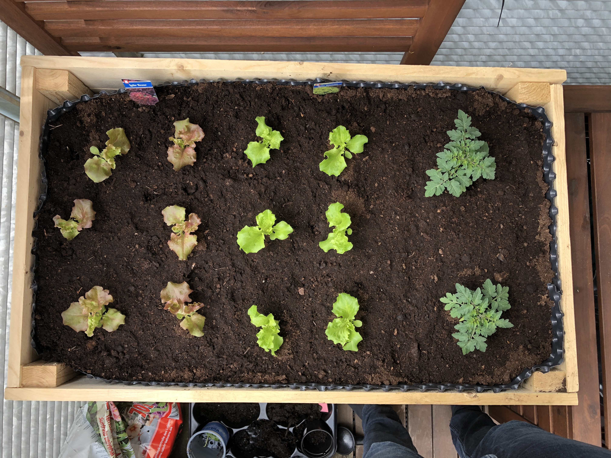

## 1. Why

Fresh homegrown tomatoes are very tasty, so building a raised bed to grow them is a no brainer. However, as I also enjoy using different kinds of technologies 
and I like to automate things, it was not far-fetched to reduce the *tremendous* effort *(/irony off)* to grow the plants with some smart things. Exploring technologies with 
such simple use cases is always a great way to learn and understand them better. 

This is the simple plan: 

1. Build raised bed & plant <- 💡 Current Step
2. Build automated watering system
3. Monitor plant growth with camera

## 2. Materials used

- Wood 11 x 2 meter planks [Bauhaus](https://www.bauhaus.info/schalung/schalbrett/p/26439895)
- Thicker planks 2 x 1.8 m [Bauhaus](https://www.bauhaus.info/latten-rahmen/rahmenholz/p/14416889)
- Noppenfolie [Bauhaus](https://www.bauhaus.info/hochbeetzubehoer/gardol-hochbeet-noppenfolie/p/26391746?gclid=EAIaIQobChMI5_6-iqbS6QIVibLVCh1sJwwkEAQYASABEgLU0fD_BwE&ef_id=EAIaIQobChMI5_6-iqbS6QIVibLVCh1sJwwkEAQYASABEgLU0fD_BwE:G:s&s_kwcid=AL!5677!3!413131788446!!!g!451090653342!&cid=PSEGoo8995092896_91171558935&pla_campid=8995092896&pla_adgrid=91171558935&pla_prpaid=451090653342&pla_prid=26391746&pla_adt=pla&pla_prch=online&pla_stco=)

